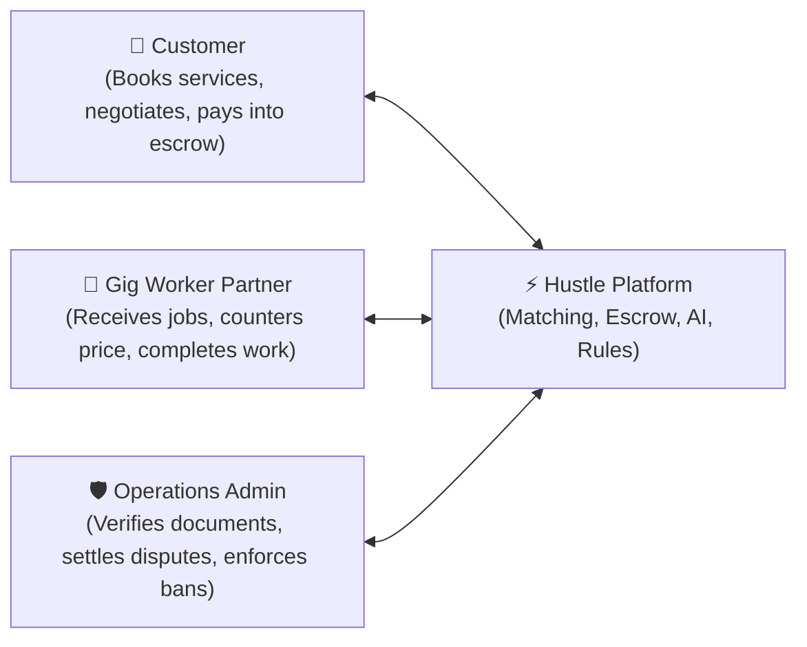
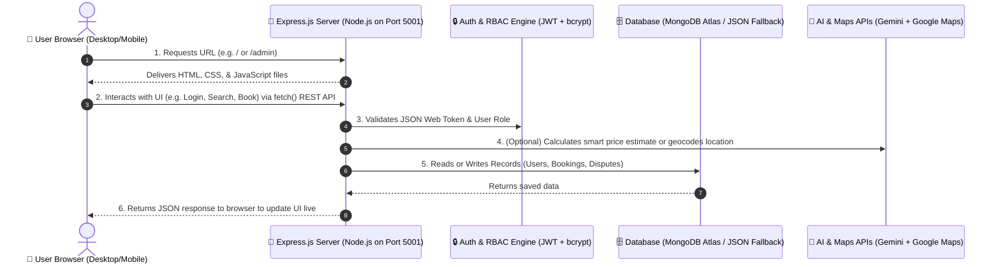
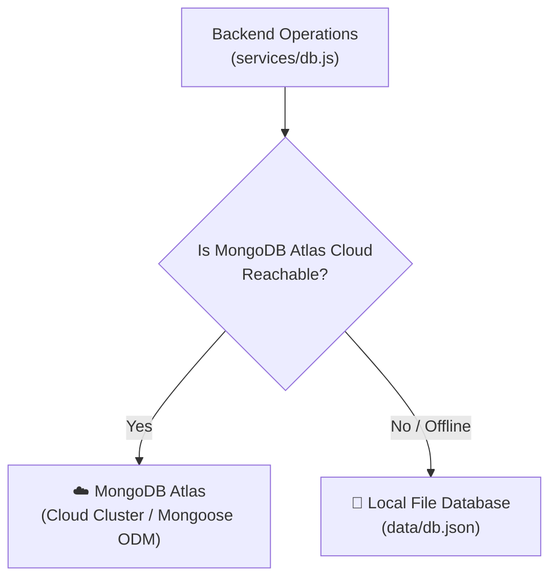
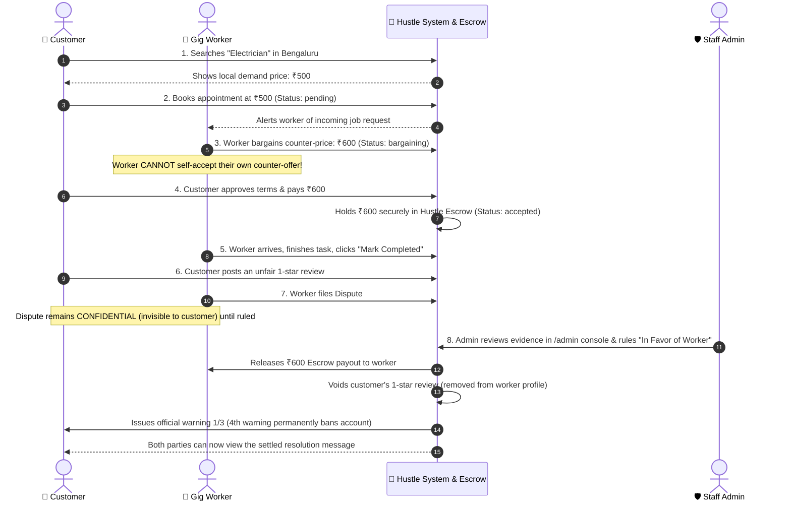

# 📘 Hustle Platform: Complete A–Z Technical Architecture Guide

> **Who this guide is for:** This document is designed for developers, teammates, and non-technical stakeholders who want a complete, beginner-friendly, and deep understanding of how Hustle works from top to bottom.

---

## 📑 Table of Contents
1. [The Big Picture: What is Hustle?](#1-the-big-picture-what-is-hustle)
2. [High-Level Architecture (The 30,000-Foot View)](#2-high-level-architecture-the-30000-foot-view)
3. [The Frontend (What the User Sees & Clicks)](#3-the-frontend-what-the-user-sees--clicks)
4. [The Backend (The Server & Business Logic)](#4-the-backend-the-server--business-logic)
5. [The Database (Where Data Lives & Persists)](#5-the-database-where-data-lives--persists)
6. [Security & Authentication (How Access is Controlled)](#6-security--authentication-how-access-is-controlled)
7. [External Integrations & AI Intelligence](#7-external-integrations--ai-intelligence)
8. [End-to-End Journey: Life of a Booking](#8-end-to-end-journey-life-of-a-booking)
9. [Project Directory & File Cheat-Sheet](#9-project-directory--file-cheat-sheet)

---

## 1. The Big Picture: What is Hustle?

Think of **Hustle** like an **"Uber for Skilled Local Trade Services"** (such as electricians, plumbers, carpenters, cleaners, and appliance mechanics).

Instead of just displaying static phone numbers like an old telephone directory, Hustle is a **dynamic, two-sided marketplace** with three distinct roles:



1. **The Customer**: Searches for help, confirms their city location, books appointments, negotiates pricing in real time, pays into a secure escrow hold, and reviews completed work.
2. **The Gig Worker (Trade Partner)**: Registers their trade (electrician, plumber, etc.), uploads verification documents for review, receives incoming job requests, proposes counter-prices, and marks jobs completed to receive payouts.
3. **The Operations Admin (Staff)**: Privately accesses `/admin` to inspect worker certificates, approve or reject worker accounts, track customer warnings, and arbitrate complaints/disputes between customers and workers.

---

## 2. High-Level Architecture (The 30,000-Foot View)

Hustle is built as a **monolithic, unified full-stack web application**. This means **one single server process** runs the backend API and simultaneously delivers the frontend web pages to the browser.



---

## 3. The Frontend (What the User Sees & Clicks)

The frontend is built using **pure, modern web standards**: **HTML5**, **CSS3**, and **Vanilla JavaScript (ES6+)**.

### Why No React, Angular, or Vue?
By avoiding heavy frameworks:
- **Zero build step**: No complex Webpack or Vite build steps; files load instantly in any browser.
- **Maximum performance**: Near-zero bundle overhead, lightning-fast initial load times on mobile.
- **Clean modularity**: Each page is focused and easy to maintain.

### Key Web Pages:

| Page | File | Purpose |
| :--- | :--- | :--- |
| **Main Marketplace** | [`index.html`](file:///Users/shounakadhya/Downloads/Hustle/index.html) | Public homepage, 18 service cards, search bar with AI price suggestions, hero section, and login triggers. |
| **Authentication** | [`auth.html`](file:///Users/shounakadhya/Downloads/Hustle/auth.html) | Combined Sign-Up & Sign-In for Customers and Workers, trade skill selection, document upload inputs, and Google One-Tap. |
| **Customer Portal** | [`customer-dashboard.html`](file:///Users/shounakadhya/Downloads/Hustle/customer-dashboard.html) | Customer dashboard: Active appointments, bargaining approval drawer, past booking history, review forms, and dispute filing. |
| **Worker Portal** | [`worker-dashboard.html`](file:///Users/shounakadhya/Downloads/Hustle/worker-dashboard.html) | Worker dashboard: Incoming requests queue, counter-bargaining price tool, work completion toggle, ratings history, and customer reporting. |
| **Admin Console** | [`admin.html`](file:///Users/shounakadhya/Downloads/Hustle/admin.html) | Dedicated staff portal: Partner verification document viewer, customer account disciplinary counters, and dispute arbitration console. |

### How JavaScript Drives the UI:
1. **[`script.js`](file:///Users/shounakadhya/Downloads/Hustle/script.js)**: Powers the public marketplace, location prompt gate, instant search autocomplete, and service filtering.
2. **[`booking-system.js`](file:///Users/shounakadhya/Downloads/Hustle/booking-system.js)**: Handles booking creation modals, mock payment processing, and escrow confirmations.
3. **[`admin.js`](file:///Users/shounakadhya/Downloads/Hustle/admin.js)**: Powers the standalone admin portal—tab switching, manual authentication, document preview rendering, and dispute verdict buttons.
4. **[`session.js`](file:///Users/shounakadhya/Downloads/Hustle/session.js)**: An abstraction (`window.HustleSession`) that stores the user profile and JWT token in browser `localStorage` or `sessionStorage` so users stay logged in when navigating across pages.

---

## 4. The Backend (The Server & Business Logic)

The backend is the "brain" running on your computer or cloud server (Render).

### Core Technologies:
- **Node.js**: The JavaScript engine that executes JavaScript on the server rather than in a browser.
- **Express.js (`server.js`)**: A fast web framework for Node.js. It listens on a network port (`5001` locally or `10000` on cloud) and determines what to do when a user visits a URL or sends data.

### How Express Routes Work:
Express separates requests into two categories:

#### 1. Page Routes (HTML delivery)
When someone types a URL into their browser address bar, Express sends the corresponding HTML file:
```javascript
// server.js
app.get('/admin', (req, res) => res.sendFile(path.join(__dirname, 'admin.html')));
app.get('/customer-dashboard', (req, res) => res.sendFile(path.join(__dirname, 'customer-dashboard.html')));
app.get('/worker-dashboard', (req, res) => res.sendFile(path.join(__dirname, 'worker-dashboard.html')));
```

#### 2. REST API Routes (Data operations)
When the frontend JavaScript calls `fetch('/api/auth/...')`, Express runs the logic in [`routes/auth.js`](file:///Users/shounakadhya/Downloads/Hustle/routes/auth.js) and sends back structured JSON:
- `POST /api/auth/signup`: Validates user inputs, hashes the password, and creates the account.
- `POST /api/auth/login`: Verifies email and password, returning a signed security token.
- `GET /api/auth/bookings`: Returns a list of appointments for the logged-in customer or worker.
- `POST /api/auth/bookings/:id/respond`: Handles price bargaining and acceptance.
- `POST /api/auth/tickets`: Files a confidential dispute ticket.
- `POST /api/auth/admin/tickets/:id/settle`: Staff arbitrates dispute and issues verdicts.

---

## 5. The Database (Where Data Lives & Persists)

Hustle uses a **Dual-Mode Resilient Database Architecture**.



### 1. Primary Engine: MongoDB Atlas
MongoDB is a modern **NoSQL Document Database**. Instead of rigid tables with rows and columns, it stores records as flexible JSON-like documents called **Objects**. We use **Mongoose** as the Object Data Modeling (ODM) library to define strict structures (Schemas).

#### The 3 Main Database Collections:

##### 👤 Users ([`models/User.js`](file:///Users/shounakadhya/Downloads/Hustle/models/User.js))
Stores all registered accounts:
- `name`, `email`, `phone`, `password` (bcrypt-hashed)
- `role`: `'customer'`, `'worker'`, or `'admin'`
- `approvalStatus`: `'pending'`, `'approved'`, or `'rejected'` (for workers)
- `skillCategory`: (e.g. `'Electrician'`, `'Plumbing'`)
- `documentFile`, `supportingDocUrl`: Verification certificate
- `warningsCount`: Disciplinary strikes (0 to 3)
- `isBanned`: Boolean (`true` = permanently banned)

##### 📅 Bookings ([`models/Booking.js`](file:///Users/shounakadhya/Downloads/Hustle/models/Booking.js))
Stores every service request and appointment:
- `customerId`, `customerName`, `workerId`, `workerName`
- `serviceName`, `price`, `scheduledDate`, `scheduledTime`
- `status`: `'pending'`, `'bargaining'`, `'accepted'`, `'completed'`, `'cancelled'`
- `negotiations`: Array of counter-offers `[{ senderRole, proposedPrice, note }]`
- `paymentStatus`: `'unpaid'`, `'paid'` (held in Hustle Escrow)
- `rating`: 1 to 5 stars, `reviewText`
- `ratingVoided`: Boolean (set to `true` if an admin dismisses a retaliatory rating)
- `disputeStatus`: Tracking active complaints

##### ⚖️ Tickets / Disputes ([`models/Ticket.js`](file:///Users/shounakadhya/Downloads/Hustle/models/Ticket.js))
Stores formal arbitration complaints:
- `ticketId`: Unique reference (e.g. `#TKT-649967`)
- `bookingId`: Link to the relevant appointment
- `raisedById`, `raisedByName`, `raisedByRole`: Complainant
- `againstId`, `againstName`: Reported counterparty
- `category`: Complaint reason (e.g. "Work Incomplete", "Harassment")
- `status`: `'open'`, `'under_review'`, `'resolved'`, `'dismissed'`
- `resolutionAction`: Verdict (`'favour_worker'`, `'favour_customer'`, `'mutual_split'`)
- `adminNotes`: Official explanation written by the staff arbitrator

### 2. Automatic Fallback Engine: `data/db.json`
If your server loses internet access or MongoDB Atlas credentials are not yet configured, the database manager ([`services/db.js`](file:///Users/shounakadhya/Downloads/Hustle/services/db.js)) automatically detects this and stores everything in a local file [`data/db.json`](file:///Users/shounakadhya/Downloads/Hustle/data/db.json). This guarantees the website **never crashes** due to database connectivity issues.

---

## 6. Security & Authentication (How Access is Controlled)

### 1. Password Protection with `bcryptjs`
We **never** store passwords in plain text. When a user creates a password like `secret123`, `bcryptjs` mixes it with random salt characters and creates a one-way mathematical hash:
```
$2a$10$e8T/k9x8...m3KYuIu1oOhwHE8U...
```
Even if someone viewed the database, they could never decode the original password. When logging in, bcrypt securely verifies if the submitted password matches the hash.

### 2. Digital VIP Wristbands: JSON Web Tokens (JWT)
When a user logs in, the backend creates a digitally signed **JWT Token**. Think of this like a tamper-proof VIP wristband given at a concert entrance:

```
eyJhbGciOiJIUzI1NiIsInR5cCI6IkpXVCJ9...
```

Inside this encrypted token is:
- `userId`: The user's ID
- `role`: `'customer'`, `'worker'`, or `'admin'`
- `expiresIn`: Valid for 7 days

Every time the user wants to book a job, accept an offer, or view their dashboard, their browser sends this token in the HTTP header:
```http
Authorization: Bearer <token>
```

### 3. Role-Based Access Control (RBAC)
To prevent customers or workers from accessing administrative data, the backend enforces strict middleware checks:
- If a customer tries to call `GET /api/auth/admin/workers`, the server checks `decoded.role === 'admin'`. Because their role is `'customer'`, the server immediately rejects the request with **`HTTP 403 Forbidden`**.

---

## 7. External Integrations & AI Intelligence

### 1. Google Maps & Geocoding API
- **Location Gate**: As soon as a customer logs in, a modal prompts them to confirm their city.
- The browser uses HTML5 GPS coordinates, and the server converts latitude/longitude into a human-readable city name (Bengaluru, Mumbai, Delhi, etc.).
- Service listings and pricing adapt specifically to the selected city.

### 2. AI Pricing Intelligence & Gemini Diagnostics
- **Demand Intelligence Engine**: When a user searches for a service (e.g. "Fix AC"), the backend checks how many active workers exist in that city and calculates their average demanding rate.
- **IRL Market Rate Fallback**: If no active workers exist in that city yet, an integrated heuristics system (backed by Google Gemini benchmarks) estimates realistic In-Real-Life (IRL) Indian market rates for that job.

---

## 8. End-to-End Journey: Life of a Booking

Here is how all the pieces interact during a real transaction:



---

## 9. Project Directory & File Cheat-Sheet

| Directory / File | Component | What it does |
| :--- | :--- | :--- |
| [`server.js`](file:///Users/shounakadhya/Downloads/Hustle/server.js) | Backend Core | Main server entry point. Configures Express, static file serving, and database initialization. |
| [`routes/auth.js`](file:///Users/shounakadhya/Downloads/Hustle/routes/auth.js) | Backend API | All REST API endpoints: registration, authentication, bookings, negotiation, reviews, disputes, and admin actions. |
| [`routes/ai.js`](file:///Users/shounakadhya/Downloads/Hustle/routes/ai.js) | Backend API | AI endpoints for service matching and task scope diagnostics. |
| [`services/db.js`](file:///Users/shounakadhya/Downloads/Hustle/services/db.js) | Database Layer | Dual-mode database manager. Handles MongoDB Atlas connections and automatic local JSON fallback. |
| [`services/gemini.js`](file:///Users/shounakadhya/Downloads/Hustle/services/gemini.js) | AI Service | Google Gemini AI integration and industry price benchmark calculations. |
| [`models/`](file:///Users/shounakadhya/Downloads/Hustle/models/) | Database Schemas | Mongoose database models: `User.js`, `Booking.js`, `Ticket.js`. |
| [`index.html`](file:///Users/shounakadhya/Downloads/Hustle/index.html) | Frontend Page | Public marketplace homepage with live service search. |
| [`customer-dashboard.html`](file:///Users/shounakadhya/Downloads/Hustle/customer-dashboard.html) | Frontend Page | Customer portal for active bookings, payments, and reviews. |
| [`worker-dashboard.html`](file:///Users/shounakadhya/Downloads/Hustle/worker-dashboard.html) | Frontend Page | Worker portal for managing incoming jobs, counter-offers, and disputes. |
| [`admin.html`](file:///Users/shounakadhya/Downloads/Hustle/admin.html) | Frontend Page | Dedicated operations and staff arbitration console (`/admin`). |
| [`admin.js`](file:///Users/shounakadhya/Downloads/Hustle/admin.js) | Frontend Script | Standalone controller for admin features and dispute settlements. |
| [`booking-system.js`](file:///Users/shounakadhya/Downloads/Hustle/booking-system.js) | Frontend Script | Client-side booking workflows, escrow holds, and negotiation drawers. |
| [`script.js`](file:///Users/shounakadhya/Downloads/Hustle/script.js) | Frontend Script | Main marketplace interactions, location detection, and AI suggestions. |
| [`session.js`](file:///Users/shounakadhya/Downloads/Hustle/session.js) | Frontend Script | Client-side authentication token and session management. |
| [`.env`](file:///Users/shounakadhya/Downloads/Hustle/.env) | Configuration | Private environment keys (never committed to GitHub). |
| [`.gitignore`](file:///Users/shounakadhya/Downloads/Hustle/.gitignore) | Git Rules | Specifies files (like `.env` and `node_modules`) that must stay private. |
